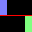
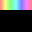
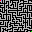
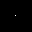
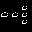

# `particlesim-pico` - PixelDust Simulator for the Raspberry Pi Pico / RP2040

This repository contains a particle simulation firmware for the
Raspberry Pi Pico / RP2040 Microcontroller. It uses an MPU6050 for orientation
input and any HUB75 RGB LED Matrix panel for output, though the code is currently
optimized towards a 32x32 1/16 scan panel.

The Algorithm is based on the
[Adafruit_PixelDust](https://github.com/adafruit/Adafruit_PixelDust) library,
but was re-written for maximum performance on the Pico.

The panel driving code is partially based on the hub75 example from the
[pico-examples](https://github.com/raspberrypi/pico-examples) but was extended
with DMA support, double-buffering and smart redrawing while waiting for the
DMA controller.

Several other modes are also supported. These currently include Snake and Conway's
Game of Life. See the list of modes below for further details.

## User Interface

The only input method currently supported are the two buttons, `SELECT` and
`RESET`.

By pressing `SELECT`, you can cycle through the different modes that are supported.
These are first all the static images and simulation stages and then the animations.

`RESET` resets the current mode to its starting point.

Pressing `RESET` while `SELECT` is pressed causes the device to reboot into
`BOOTSEL`-Mode, allowing for firmware updates over USB.

Holding both `RESET` and `SELECT` during power-up will enter diagnosis mode,
which displays diagnostic information on the screen for easy debugging without
having to attach the device to a computer.

### List of modes

| ID  | Image                          | Name                                 | Description                                                                                                                                          |
|-----|--------------------------------|--------------------------------------|------------------------------------------------------------------------------------------------------------------------------------------------------|
| 0   |        | **Dual**                             | Two blocks of particles separated by a line.<br/>Initially designed as a test case for wall-glitching.                                               |
| 1   |    | **Distribution**                     | Intended to demonstrate a normal distribution.<br/>Doesn't work quite perfectly, since particles are not spheres.                                    |
| 2   |      | **ZigZag**                           | Try to get all the particles into the lower "chamber" with as little moves as possible!                                                              |
| 3   |  | **Rainbow**                          | Rainbow made of particles.<br/>While this currently has the most unique colors (32), it still does not demonstrate the full 24-bit colors available. |
| 4   |        | **RGB-Testpattern**                  | Test pattern for orientation and correct channel connections.<br/>Should be Red-Green-Blue-Magenta from top to bottom.                               |
| 5   |        | **Maze**                             | Static maze                                                                                                                                          |
| 6   |      | **Single Particle**                  | Single particle with normal elasticity                                                                                                               |
| 7   |      | **Single Particle, bouncy**          | Extra bouncy single particle<br/>This particle should bounce forever, as if it never loses energy. Can make cool patterns.                           |
| 8   |       | **Blank Stage**                      | Blank stage<br/>For use when creating new stages and checking that all LEDs fully turn off.                                                          |
| 9   |        | **Single Glider**                    | Probably the most well-known Game of Life pattern.                                                                                                   |
| 10  |        | **Two Gliders**                      | Two gliders travelling perpendicular to each other<br/>The gliders should never collide with each other.                                             |
| 11  |         | **Pulsar**                           | Pulsar with period 3 (P3)                                                                                                                            |
| 12  |           | **P144**                             | Pulsar with period 144                                                                                                                               |
| 13  |        | **O112P15**                          | Oscillating pattern that doesn't quite work due to the limited size                                                                                  |
| 14  |          | **Ships**                            | Five spaceships travelling in formation.<br/>One HWSS, one MWSS and three LWSS                                                                       |
| 15  |     | **R-Pentomino Methuselah**           | Long-lived pattern that doesn't quite work as intended due to limited size                                                                           |
| 16  |                                | **Soup with p=0.5**                  | Random soup with 50% density.<br/>Regenerated on every reset.                                                                                        |
| 17  |                                | **Soup with p=0.375**                | Random soup with 37.5% density.<br/>Regenerated on every reset. Probably the best density for interesting and long-lived soups.                      |
| 18  |                                | **Soup with p=0.25**                 | Random soup with 25% density.<br/>Regenerated on every reset.                                                                                        |
| 19  |                                | **Color Cycle**                      | Normal speed color cycle.<br/>Period is approximately 6 seconds.                                                                                     |
| 20  |                                | **Slow Color Cycle**                 | Slow speed color cycle.<br/>Period is approximately 24 seconds.                                                                                      |
| 21  |                                | **Ultra Slow Color Cycle**           | Ultra slow speed color cycle.<br/>Period is approximately 60 seconds.                                                                                |
| 22  |                                | **Perlin Noise**                     | Perlin noise.<br/>Currently not implemented, displays as a static magenta screen.                                                                    |
| 23  |                                | **Snake, slow**                      | Snake, with wall collisions, slow<br/>Snake head will be blue and first fruit green.                                                                 |
| 24  |                                | **Snake, medium**                    | Snake, with wall collisions, medium<br/>Snake head will be green and first fruit green.                                                              |
| 25  |                                | **Snake, fast**                      | Snake, with wall collisions, fast<br/>Snake head will be red and first fruit green.                                                                  |
| 26  |                                | **Snake, slow, no wall collision**   | Snake, with no wall collisions, slow<br/>Snake head will be blue and first fruit blue.                                                               |
| 27  |                                | **Snake, medium, no wall collision** | Snake, with no wall collisions, medium<br/>Snake head will be green and first fruit blue.                                                            |
| 28  |                                | **Snake, fast, no wall collision**   | Snake, with no wall collisions, fast<br/>Snake head will be red and first fruit blue.                                                                |

#### Particle Simulations

The modes with the IDs 0-8 are particle simulations.

TODO: Describe particle simulation details and caveats here

#### Game of Life

The modes with the IDs 9-15 are [Game of Life](https://en.wikipedia.org/wiki/The_Game_of_Life)
cellular automata simulations.

The simulation takes place in a 32x32 toroidal universe, e.g. opposing screen edges
are connected.

For all stages (except `Pulsar`), the simulation engine automatically detects if
the simulation has entered a cycle of length 4 or shorter. This only works for static
cycles, moving cycles of patterns (like gliders) are ignored.
Once such a cycle has been found, the simulation will automatically restart, generating
a new soup in the case that a soup was running.

#### Color Cycle Animations

The modes with the IDs 19-21 are HSV color cycles, with entire screen filled
with the same color.

#### Perlin Noise

The mode with the ID 22 displays a slowly changing perlin noise pattern.

TODO: implement this mode

#### Snake

The modes with the IDs 23-28 implement the classic game Snake with different settings.

See the list of modes for specific settings. The active settings are indicated by
the color of the snake head and the first fruit (which becomes the first piece after
the header once eaten).

## Hardware

The electronics consist of the following items:
- RP2040-based microcontroller board, e.g. Raspberry Pi Pico
- 5V Power Supply, rated for at least 2A (depends on LED Matrix)
- MPU6050 Gyroscope/Accelerometer
- HUB75 RGB LED Matrix, e.g. 32x32 1/16 scan
- 2x Momentary Buttons, optionally with caps

### Notes about the power supply

Most RGB LED Matrices seem to be rated at 5V, though many can also be underdriven
down to 3.3V without much loss of brightness if a slight red hue is acceptable.

Also, the 2A spec is based on the panel I had available, which would draw ~1.6A
with an all-white screen. Panels from different manufacturers may differ and
are also likely to vary from panel to panel. The current draw for a single simulation
stage should always be constant, since pixels are only moving around.

A smaller PSU is likely fine, since the screen should usually not be at full white.
Still, a minimum of 1A is strongly recommended.

When using a longer power cable, it is recommended to add a bulk decoupling
capacitor (100uF-470uF) to the system to prevent voltage drop during operation.

### Electrical Connections

(HUB75 Pinout Diagram taken from [pico-examples repository](https://github.com/raspberrypi/pico-examples/blob/master/pio/hub75/Readme.md))

HUB75 pinout for a 1/16 scan panel:

```
    /-----\
R0  | o o | G0
B0  | o o | GND
R1  | o o | G1
B1  \ o o | GND
A   / o o | B
C   | o o | D
CLK | o o | STB
OEn | o o | GND
    \-----/
```

It is recommended to keep the lengths of the individual wires similar and away from
the MPU6050.

The following connections should be made:
- R0 -> GP6
- G0 -> GP7
- B0 -> GP8
- R1 -> GP9
- G1 -> GP10
- B1 -> GP11
- A -> GP12
- B -> GP13
- C -> GP14
- D -> GP15
- CLK -> GP16
- STB -> GP17
- OEn -> GP18
- All GND -> GND

For the MPU6050, the following connections should be made:
- SDA -> GP4
- SCL -> GP5
- INT -> 
- VCC -> 3V3 Out
- GND -> GND

The INT connection is currently not used by the firmware, but may be added in
future versions.

For the two Buttons, the following connections should be made:
- `SELECT` Button -> GP2
- `RESET` Button -> GP3
- Other side of both Buttons -> GND

Also, both the Pico and the panel will need to be supplied with power. If powered
separately, the panel should be powered on first and powered down last.

### Case

TODO: design case and link here

## Software

The firmware is available as a UF2 on the
[GitHub Releases Page](https://github.com/not-na/particlesim-pico/releases),
though this may not include the latest changes.

### Manual Compilation

If you either want a more recent version or want to modify some part of the code
or add stages or universes, you will need to compile the firmware yourself.
Otherwise, you can skip ahead to the [Installation](#installation) section.

The general process of compiling for the Pico is explained in detail in the
official [Getting Started Guide (PDF)](https://rptl.io/pico-get-started). Most
important is that you have installed all the dependencies and have a local SDK
installation. The automatically run conversion script for stages and universes 
also requires Python 3.7 or later to be available.

Then, you should run the following commands while in the directory this file is in:
    
    $ mkdir build/
    $ cd build
    $ export PICO_SDK_PATH="<PATH TO SDK>"
    $ cmake -DCMAKE_BUILD_TYPE=Release ..
    $ make

Be sure to replace the `<PATH TO SDK>` placeholder with the actual install path
of the Pico SDK.

When all commands are run successfully, a `particlesim.uf2` file
should appear in the `build/` directory. This file can be used to install your
custom firmware build.

If you ran the commands above already and just want to quickly recompile the
firmware, it is usually enough to just run `make` from the `build/` directory.

### Image Compilation / Conversion

When adding or changing images, they must be converted to C header files to be
included in the firmware.

The conversion script is written in Python and should run with Python 3.7 or newer.

Usually, it is not necessary to manually run this conversion script. It will be
automatically run by CMake on every build.

To add new stages (or change their order/parameters), see the `active_stages.def`
file.

To add new Game of Life universes (or change their order), see the `active_universes.def`
file.

#### Stage Image Format

Images should be PNG files with 8 BPC (bits per channel) color depth in either
RGB or RGBA format. Note that automatic particle detection only works with the
RGBA format.

All fully black pixels are treated as able to be occupied by a particle and pixels
that are not fully opaque are treated as particles.

During image conversion, transparent pixels are replaced by black pixels and stored
in a separate list. The firmware treats any non-zero integer in the raw image data
as an obstacle, making it possible to create invisible obstacles by manually editing
the header file. The format for colors stored in the headers is BGR888, e.g. 0x00BBGGRR.

Currently, the amount of particles is limited to 512 per image. This is mainly
because the simulation takes more time for larger amounts of particles. The 512
particle limit is equivalent to every second on-screen pixel being a particle.

#### Game of Life image Format

Images should be PNG files with 8 BPC (bits per channel) color depth in either
RGB or RGBA format.

All pixels with a red channel value greater than `0x80` (128) are treated as alive.
All others are treated as dead.

It is recommended to simply use white pixels for alive cells and black pixels for
dead cells.

There is no limit to the number of active pixels. Note that the simulation wraps around,
e.g. the top/bottom and left/right edges are connected.

### Installation

Installing the firmware is very easy thanks to the UF2 Standard supported by the
Pico / RP2040. To flash the firmware, hold down the `BOOTSEL` button *before* plugging
the board in the USB port.

Alternatively, you can hold down `SELECT` and press `RESET` while `SELECT` is pressed
when updating an older version of the firmware.

After a few seconds, a new flash drive with the name `RPI-RP2` should
show up in your file manager. Simply drag the new firmware UF2 file onto this
drive. If successful, the Pico will unmount itself automatically and start the
new firmware.
