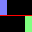
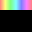
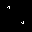
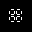
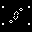
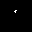

# `particlesim-pico` - Partikelsimulator für den Raspberry Pi Pico / RP2040

**[English Version](README.md)**

Dieses Repository enthält den Quellcode für eine Partikelsimulationsfirmware für
den Raspberry Pi Pico bzw. RP2040. Als Orientierungssensor wird ein MPU6050 verwendet,
als Display eine beliebige HUB75-basierte RGB-LED Matrix. Der Quellcode ist derzeit
für 32x32 1/16 scan LED-Matrizen optimiert.

Der Algorithmus für die Partikelsimulation wurde basierend auf der
[Adafruit_PixelDust](https://github.com/adafruit/Adafruit_PixelDust) Bibliothek
entwickelt. Der Algorithmus wurde dabei für maximale Geschwindigkeit auf dem Pico
optimiert. Es werden bis zu 512 Partikel (also ca. die Hälfte des Bildschirms)
bei einer Updaterate von 120Hz ohne Geschwindigkeitsprobleme unterstützt.

Der Displaytreiber basiert teilweise auf dem HUB75-Beispiel aus dem
[pico-examples](https://github.com/raspberrypi/pico-examples) Repository. Der
Treiber wurde um DMA-Unterstützung, Doppelpufferung und intelligente Zeichenalgorithmen
erweitert. Es werden 8-bit (pro Kanal, also 24-bit pro Pixel) Farben unterstützt.
Die Helligkeit ist einstellbar ohne Verlust von Farbauflösung und standardmäßig
auf ca. 50% eingestellt.

Zusätzlich zur Partikelsimulation werden noch viele andere Modi unterstützt, z.b.
Snake und Conway's Game of Life. Siehe die [Liste von Modi](#liste-von-modi)

## Benutzerschnittstelle

Derzeit besteht die Benutzerschnittstelle aus zwei Tastern, `Modus` und `Reset`.

Durch Drücken von `Modus` kann durch die [Liste von Modi](#liste-von-modi) iteriert
werden. Die Auswahl springt nach Ende der Liste wieder an den Anfang zurück.

`Reset` setzt den aktuellen Modus auf den Anfangszustand zurück. Bei Modi mit zufällig
generierten Bestandteilen werden diese neu generiert.

Wenn `Reset` gedrückt wird, während `Modus` gedrückt gehalten wird, startet das
Gerät neu in den sogenannten `BOOTSEL`-Modus, wodurch Firmware-Updates per USB
möglich sind.

Wenn sowohl `Reset` als auch `Modus` gedrückt gehalten werden beim Einschalten,
startet die Firmware im Diagnose-Modus. Im Diagnose-Modus werden verschiedene
Debugging-Information wie z.B. die aktuell laufende Firmware-Version angezeigt.

### Liste von Modi

| ID  | Bild                           | Name                                        | Beschreibung                                                                                                                        |
|-----|--------------------------------|---------------------------------------------|-------------------------------------------------------------------------------------------------------------------------------------|
| 0   |        | **Dual**                                    | Zwei Blöcke von Partikeln getrennt durch eine dünne Linie. Ursprünglich als Testszenario entwickelt.                            |
| 1   |    | **Verteilung**                              | Gedacht als Demonstration einer Normalverteilung. Funktioniert aufgrund der nicht idealen Partikel nicht richtig.               |
| 2   |      | **ZigZag**                                  | Versuche, alle Partikel mit so wenig wie möglich "Zügen" in die untere Kammer zu bringen!                                           |
| 3   |  | **Regenbogen**                              | Regenbogen aus Partikeln. Modus mit den meisten unterschiedlichen Farben (32), dennoch weit weniger als möglich (2^24)          |
| 4   |        | **RGB-Testmuster**                          | Testmuster für Ausrichtung und richtige Kanalverdrahtung. Sollte Rot-Grün-Blau-Magenta von oben nach unten sein.                |
| 5   |        | **Labyrinth**                               | Statisches Labyrinth.                                                                                                               |
| 6   |      | **Einzelner Partikel**                      | Einzelnes Partikel                                                                                                                  |
| 7   |      | **Einzelner Partikel, ohne Energieverlust** | Einzelne Partikel mit maximaler Abprallstärke. Verliert fast keine Energie beim Abprallen, kann z.B. Lissajous-Muster erzeugen. |
| 8   |       | **Blanker Bildschirm**                      | Blanker Modus. Als Basis für neue Modi oder zum Testen, ob alle LEDs voll ausschalten, gedacht.                                 |
| 9   |        | **Einzelner Glider**                        | Das vermutlich bekannteste Game of Life Muster.                                                                                     |
| 10  |        | **Zwei Gliders**                            | Zwei Glider mit rechtwinkligen Fahrtrichtungen.                                                                                     |
| 11  |         | **Pulsar**                                  | Pulsar mit periode 3 (P3)                                                                                                           |
| 12  |           | **P144**                                    | Pulsar mit periode 144                                                                                                              |
| 13  |        | **O112P15**                                 | Oszillierendes Muster, welches aufgrund der limitierten Größe nicht korrekt funktioniert.                                           |
| 14  |          | **Raumschiffe**                             | Fünf Raumschiffe in Formation Ein HWSS, ein MWSS und drei LWSS                                                                  |
| 15  |     | **R-Pentomino Methuselah**                  | Langlebiges Muster das nicht vollständig korrekt funktioniert aufgrund der limitierten Größe.                                       |
| 16  |                                | **Suppe mit p=0.5**                         | Zufällige Suppe mit 50% Dichte. Bei jedem Reset neu generiert.                                                                  |
| 17  |                                | **Suppe mit p=0.375**                       | Zufällige Suppe mit 50% Dichte. Bei jedem Reset neu generiert. Vermutlich die beste Dichte für interessante Suppen.             |
| 18  |                                | **Suppe mit p=0.25**                        | Zufällige Suppe mit 50% Dichte. Bei jedem Reset neu generiert.                                                                  |
| 19  |                                | **Farbzyklus**                              | Normal schneller Farbzyklus. Periodenlänge ist ca. 6 Sekunden.                                                                  |
| 20  |                                | **Langsamer Farbzyklus**                    | Langsamer Farbzyklus. Periodenlänge ist ca. 24 Sekunden.                                                                        |
| 21  |                                | **Sehr langsamer Farbzyklus**               | Sehr langsamer Farbzyklus. Periodenlänge ist ca. 60 Sekunden.                                                                   |
| 22  |                                | **Perlin Noise**                            | Perlin noise. Noch nicht implementiert, zeigt nur statisches Magenta.                                                           |
| 23  |                                | **Snake, langsam**                          | Snake, mit Wandkollisionen, langsam. Kopf ist blau, erste Frucht ist grün.                                                      |
| 24  |                                | **Snake, medium**                           | Snake, mit Wandkollisionen, medium. Kopf ist grün, erste Frucht ist grün.                                                       |
| 25  |                                | **Snake, schnell**                          | Snake, mit Wandkollisionen, schnell. Kopf ist rot, erste Frucht ist grün.                                                       |
| 26  |                                | **Snake, langsam, ohne Wandkollisionen**    | Snake, ohne Wandkollisionen, langsam. Kopf ist blau, erste Frucht ist blau.                                                     |
| 27  |                                | **Snake, medium, ohne Wandkollisionen**     | Snake, ohne Wandkollisionen, medium. Kopf ist grün, erste Frucht ist blau.                                                      |
| 28  |                                | **Snake, schnell, ohne Wandkollisionen**    | Snake, ohne Wandkollisionen, schnell. Kopf ist rot, erste Frucht ist blau.                                                      |

#### Partikelsimulationen

Die Modi mit den IDs 0 bis 8 sind Partikelsimulationen.

TODO: Mehr details

#### Game of Life

Die Modi mit den IDs 9 bis 15 sind [Game of Life](https://de.wikipedia.org/wiki/Conways_Spiel_des_Lebens)-Simulationen
von zellulären Automaten.

Die Simulation findet in einem 32x32 toroidalen Universum statt, d.h. gegenüberliegende Kanten
des Bildschirms gelten als verbunden.

Für alle Universen (außer `Pulsar`) findet eine automatische Zyklenerkennung statt.
Falls ein Zyklus der Länge 4 oder kürzer erkannt wird, startet die Simulation automatisch neu.
Die Zyklenerkennung funktioniert nur für statische Zyklen, bewegende Muster (z.B. Glider)
werden nicht erkannt.

#### Farbzyklen

TODO

#### Snake

TODO

## Hardware

TODO

### Hinweise zur Stromversorgung

TODO

### Elektrische Verbindungen

TODO

### Gehäuse

TODO

## Firmware

TODO

### Manuelle Kompilierung

TODO

### Bild / Universum Konvertierungsprogramm

TODO

#### Partikelbildformat

TODO

#### Game of Life Bildformat

TODO

### Installation

TODO